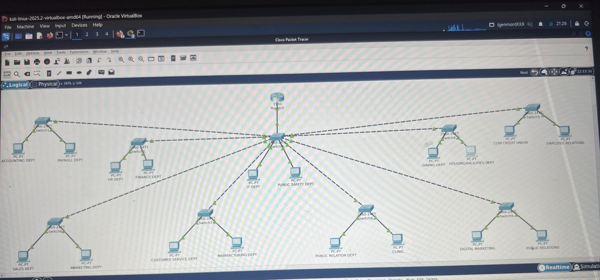

# Enterprise Campus Network Segmentation Lab

> A Cisco Packet Tracer simulation of an enterprise campus network — **9 VLANs · 18 departments · 9 switches · 9 ASA5505 firewalls · Router-on-a-Stick · 0% packet loss**.

## View the project

**Live project site:** https://mandozone.github.io/Enterprise-Campus-Network-SegmentationLab-/

If you are viewing this repository on GitHub, start with the live site above or read the summary below. The `site/` folder contains the rendered portfolio page files, so opening `site/index.html` inside GitHub will show source code rather than the website.

**All 9 firewalls in this lab were configured by Romando Wright.**



---

## TL;DR for Recruiters

| | |
|---|---|
| **Problem** | A flat 18-department network — single broadcast domain, no segmentation, no protection against lateral movement. |
| **What I built** | Three-tier hierarchical Cisco network: 1 router, 1 core/distribution switch, 9 access switches, 9 VLANs, 9 ASA5505 firewalls. |
| **How I validated it** | Cisco IOS CLI evidence: `show vlan brief`, `show ip interface brief`, `write memory`, and a 4/4 ping at 0% packet loss between VLANs. |
| **Why it matters** | Maps directly to the standard Cisco enterprise design pattern used in production campus networks. |

## Skills demonstrated

`Cisco IOS CLI` · `VLAN Design` · `802.1Q Trunking` · `Router-on-a-Stick` · `Inter-VLAN Routing` · `Hierarchical Network Design` · `Cisco ASA5505 Firewall Deployment` · `CLI Troubleshooting` · `End-to-End Network Validation` · `Cisco Packet Tracer`

## Architecture overview

```
                  Router0   (Gig0/0 — Router-on-a-Stick)
                                 │
                  [ Switch3 — Core / Distribution ]
                                 │
        ┌──────┬──────┬──────┬──┴──┬──────┬──────┬──────┐
       SW1   SW2    SW4    SW5    SW6    SW7    SW8    SW9
        │     │      │      │      │      │      │      │
       PCs   PCs    PCs    PCs    PCs    PCs    PCs    PCs
                  ── ASA5505 perimeter & departmental ──
```

| Layer | Role | Device(s) |
|---|---|---|
| Routing | Inter-VLAN routing via 802.1Q subinterfaces | `Router0` (Cisco 1941) |
| Core / Distribution | VLAN aggregation, trunk uplinks | `Switch3` (Catalyst 2960-24TT) |
| Access | Per-department ports, VLAN assignment | `SW1, SW2, SW4–SW9` |
| Security Perimeter | Inter-zone policy & stateful inspection | `9 × Cisco ASA5505` |

## VLAN segmentation plan

| VLAN | Name | Departments | Subnet | Gateway |
|---|---|---|---|---|
| 10 | `ACCOUNTING` | Accounting / Payroll | `192.168.10.0/24` | `192.168.10.1` |
| 20 | `HR-FINANCE` | HR / Finance | `192.168.20.0/24` | `192.168.20.1` |
| 30 | `IT-SECURITY` | IT / Public Safety | `192.168.30.0/24` | `192.168.30.1` |
| 40 | `FACILITIES` | Dining / Facilities | `192.168.40.0/24` | `192.168.40.1` |
| 50 | `UNION` | Union / Employee Relations | `192.168.50.0/24` | `192.168.50.1` |
| 60 | `SALES` | Sales / Marketing | `192.168.60.0/24` | `192.168.60.1` |
| 70 | `MANUFACTURING` | Customer Service / Manufacturing | `192.168.70.0/24` | `192.168.70.1` |
| 80 | `PR-CLINIC` | PR / Clinic | `192.168.80.0/24` | `192.168.80.1` |
| 90 | `DIGITAL-MEDIA` | Digital Media / Public Relations | `192.168.90.0/24` | `192.168.90.1` |

## Firewall work — Romando Wright

All nine Cisco ASA5505 firewalls in this lab were built and configured by Romando Wright:

- Interface assignment on each ASA (inside / outside / DMZ-style zones)
- Security-level configuration so higher-trust zones can initiate to lower-trust zones
- Inter-zone policy preventing cross-department lateral movement
- Integration with the Switch3 core/distribution layer and the Router0 Router-on-a-Stick
- End-to-end verification — 4/4 ping replies at 0% packet loss across the inter-VLAN path

## Evidence — what each screenshot proves

| Screenshot | Proves |
|---|---|
| [`topology-overview.jpg`](site/assets/topology-overview.jpg) | Early topology layout — departments grouped under access switches |
| [`topology-trunking.jpg`](site/assets/topology-trunking.jpg) | First 802.1Q trunk wired between access switches |
| [`topology-hierarchical.jpg`](site/assets/topology-hierarchical.jpg) | Full Router → Core → Access hierarchy with every link green |
| [`topology-final-master.jpg`](site/assets/topology-final-master.jpg) | `master network.pkt` — final completed file |
| [`switch-vlan-creation.jpg`](site/assets/switch-vlan-creation.jpg) | Cisco IOS CLI creating VLANs 10 → 90 with names |
| [`switch-show-vlan-brief.jpg`](site/assets/switch-show-vlan-brief.jpg) | `show vlan brief` — all 9 VLANs ACTIVE in the database |
| [`router-subinterface-config.jpg`](site/assets/router-subinterface-config.jpg) | Router0 subinterfaces with `encapsulation dot1Q` + IP |
| [`router-encap-write-memory.jpg`](site/assets/router-encap-write-memory.jpg) | Live troubleshooting: VID conflict caught and fixed, `write memory` |
| [`router-show-ip-interface.jpg`](site/assets/router-show-ip-interface.jpg) | `show ip interface brief` — `Gig0/0.10` and `Gig0/0.20` up/up |
| [`ping-accounting.jpg`](site/assets/ping-accounting.jpg) | 4/4 replies, 0% loss from Accounting DEPT to its gateway |

Original unedited photos are preserved under [`site/assets/originals/`](site/assets/originals/).

## What recruiters should notice

1. **Real Cisco IOS CLI work, not slideware.** Every claim is backed by a screenshot in the [Evidence](#evidence--what-each-screenshot-proves) table.
2. **Standard enterprise design pattern.** Three-tier hierarchy with explicit segmentation — the same model used in production campus networks.
3. **Live troubleshooting.** The router-encap screenshot shows a real diagnostic moment: an `encapsulation` ordering error caught and corrected from the CLI.
4. **End-to-end verification.** A ping isn't a guess — `Sent = 4, Received = 4, Lost = 0 (0% loss)` from one VLAN host to another VLAN's gateway proves Router-on-a-Stick is actually routing.

## View the site

The polished web presentation lives in [`site/`](./site/):

```bash
cd site
python3 -m http.server 8080
# → http://localhost:8080/
```

Or open [`site/index.html`](./site/index.html) directly. For GitHub Pages, point Pages at the `/site` directory on `main`.

## Project files

- [`enterprise-campus-network-lab (2).pdf`](./enterprise-campus-network-lab%20\(2\).pdf) — long-form writeup
- [`site/`](./site/) — recruiter-facing static site (HTML + CSS + image evidence)
- `master network.pkt` — final saved Packet Tracer file (not in repo)

## Credits

- **Network design, configuration, troubleshooting, and validation:** Romando Wright
- **All 9 ASA5505 firewalls:** Romando Wright
- **Platform:** Cisco Packet Tracer · Cisco IOS 15.1 · Kali Linux 2025.2 (VirtualBox)
