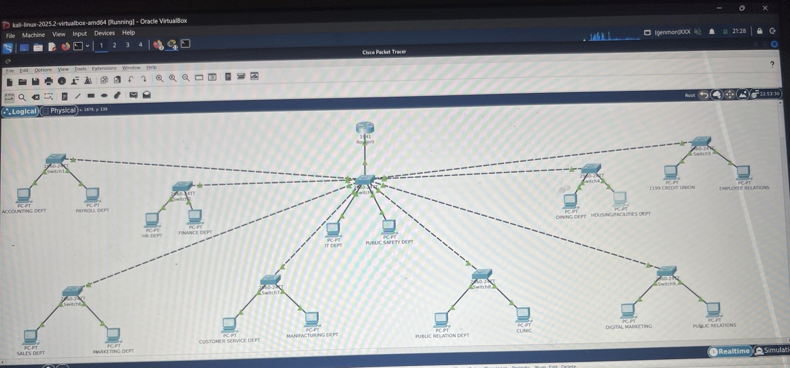

# Enterprise Campus Network Segmentation Lab

> Cisco Packet Tracer enterprise networking lab focused on VLAN segmentation, inter-VLAN routing, firewall deployment, troubleshooting, and validation.

## Live Project

**Portfolio site:** https://mandozone.github.io/Enterprise-Campus-Network-SegmentationLab-/

The site is deployed automatically from the `site/` directory through GitHub Actions.



---

## Recruiter Summary

| | |
|---|---|
| **Problem** | A flat 18-department network with no logical segmentation and excessive lateral-movement exposure. |
| **What I built** | A hierarchical Cisco lab with 1 router, 1 core/distribution switch, 9 access switches, 9 VLANs, and 9 ASA5505 firewalls. |
| **What I configured** | VLANs, 802.1Q trunks, router subinterfaces, inter-VLAN routing, firewall interfaces/security levels, and departmental segmentation. |
| **How I validated it** | Cisco IOS CLI evidence including `show vlan brief`, `show ip interface brief`, configuration saves, link-state checks, and successful ping tests. |
| **Why it matters** | Demonstrates practical network segmentation, CLI troubleshooting, firewall deployment, and evidence-based validation. |

## Skills Demonstrated

`Cisco IOS CLI` · `VLAN Design` · `802.1Q Trunking` · `Router-on-a-Stick` · `Inter-VLAN Routing` · `Hierarchical Network Design` · `Cisco ASA5505` · `Network Segmentation` · `CLI Troubleshooting` · `Packet Tracer`

## Architecture

```text
                  Router0 — Router-on-a-Stick
                            |
                Switch3 — Core / Distribution
                            |
        +---------+---------+---------+
        |         |         |         |
      Access    Access    Access    Access
      Switches  Switches  Switches  Switches
        |         |         |         |
     Departmental VLANs + ASA5505 firewalls
```

| Layer | Role | Device(s) |
|---|---|---|
| Routing | Inter-VLAN routing through 802.1Q subinterfaces | `Router0` (Cisco 1941) |
| Core / Distribution | VLAN aggregation and trunk uplinks | `Switch3` (Catalyst 2960-24TT) |
| Access | Department-facing switch ports and VLAN assignment | `SW1, SW2, SW4–SW9` |
| Security | Departmental firewall policy and stateful inspection | `9 × Cisco ASA5505` |

## VLAN Segmentation Plan

| VLAN | Name | Departments | Subnet | Gateway |
|---|---|---|---|---|
| 10 | `ACCOUNTING` | Accounting / Payroll | `192.168.10.0/24` | `192.168.10.1` |
| 20 | `HR-FINANCE` | HR / Finance | `192.168.20.0/24` | `192.168.20.1` |
| 30 | `IT-SECURITY` | IT / Public Safety | `192.168.30.0/24` | `192.168.30.1` |
| 40 | `FACILITIES` | Dining / Facilities | `192.168.40.0/24` | `192.168.40.1` |
| 50 | `UNION` | Union / Employee Relations | `192.168.50.0/24` | `192.168.50.1` |
| 60 | `SALES` | Sales / Marketing | `192.168.60.0/24` | `192.168.60.1` |
| 70 | `MANUFACTURING` | Customer Service / Manufacturing | `192.168.70.0/24` | `192.168.70.1` |
| 80 | `PR-CLINIC` | PR / Clinic | `192.168.80.0/24` | `192.168.80.1` |
| 90 | `DIGITAL-MEDIA` | Digital Media / Public Relations | `192.168.90.0/24` | `192.168.90.1` |

## Firewall Work

I configured all nine Cisco ASA5505 firewalls used in this lab, including:

- Inside/outside interface assignment
- Security-level configuration
- Departmental traffic-policy design
- Integration with the switching and routing layers
- End-to-end connectivity verification

## Evidence

| Screenshot | What it demonstrates |
|---|---|
| [`topology-overview.jpg`](site/assets/topology-overview.jpg) | Early departmental topology and access-layer design |
| [`topology-trunking.jpg`](site/assets/topology-trunking.jpg) | 802.1Q trunk implementation |
| [`topology-hierarchical.jpg`](site/assets/topology-hierarchical.jpg) | Completed Router → Core → Access hierarchy |
| [`topology-final-master.jpg`](site/assets/topology-final-master.jpg) | Final completed Packet Tracer topology |
| [`switch-vlan-creation.jpg`](site/assets/switch-vlan-creation.jpg) | VLAN creation from Cisco IOS CLI |
| [`switch-show-vlan-brief.jpg`](site/assets/switch-show-vlan-brief.jpg) | VLAN database validation |
| [`router-subinterface-config.jpg`](site/assets/router-subinterface-config.jpg) | Router subinterfaces and `encapsulation dot1Q` configuration |
| [`router-encap-write-memory.jpg`](site/assets/router-encap-write-memory.jpg) | Troubleshooting and configuration persistence |
| [`router-show-ip-interface.jpg`](site/assets/router-show-ip-interface.jpg) | Interface state validation |
| [`ping-accounting.jpg`](site/assets/ping-accounting.jpg) | Successful gateway connectivity test |

Original screenshots are preserved under [`site/assets/originals/`](site/assets/originals/).

## What Recruiters Should Notice

- **Hands-on CLI work:** configuration and troubleshooting are backed by screenshots rather than described only in prose.
- **Segmentation mindset:** the lab separates departmental traffic using VLANs, routing boundaries, and firewalls.
- **Troubleshooting evidence:** the portfolio includes configuration mistakes, corrections, and validation steps rather than only the final state.
- **Documentation:** the live site turns raw lab work into a concise technical narrative that can be reviewed quickly.

## Repository Structure

| Path | Purpose |
|---|---|
| `README.md` | Recruiter-facing project summary |
| `site/index.html` | Portfolio presentation |
| `site/styles.css` | Site styling |
| `site/assets/` | Technical screenshots and supporting evidence |
| `.github/workflows/pages.yml` | Automated GitHub Pages deployment |

## Author

**Romando Wright** — network design, configuration, firewall work, troubleshooting, validation, and documentation.
